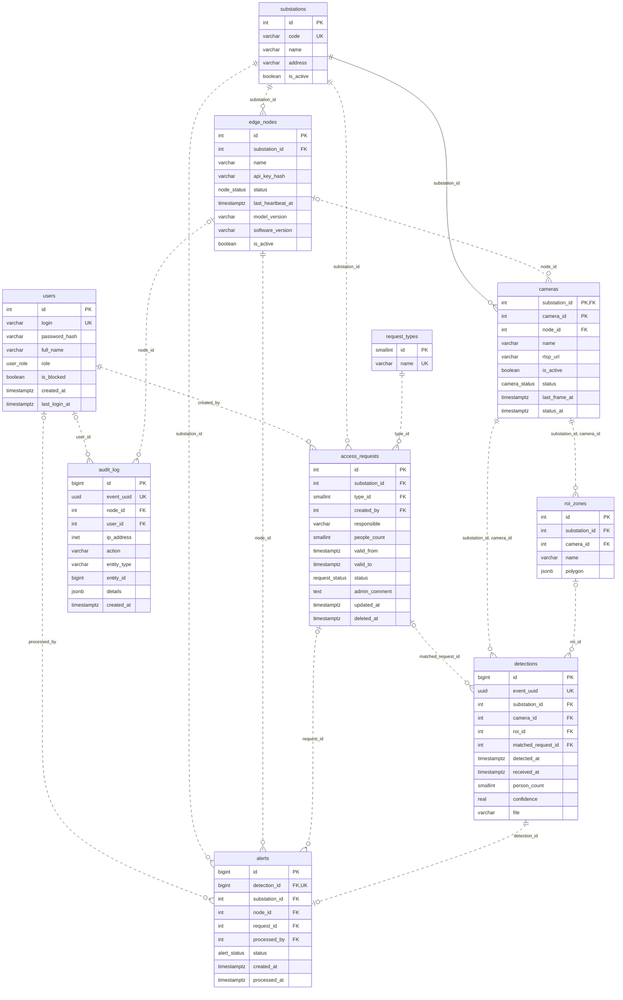

# Схема центральной БД

Ревизия `0005_kafka_camera_events`. Описание полей, составных ключей и связей приведено в [основном документе](БД%20центра.md).

```mermaid
erDiagram
    users ||..o{ access_requests : created_by
    users |o..o{ alerts : processed_by
    users |o..o{ audit_log : user_id
    substations ||..o{ edge_nodes : substation_id
    substations ||--o{ cameras : substation_id
    substations ||..o{ access_requests : substation_id
    substations ||..o{ alerts : substation_id
    edge_nodes |o..o{ cameras : node_id
    edge_nodes ||..o{ alerts : node_id
    edge_nodes |o..o{ audit_log : node_id
    request_types ||..o{ access_requests : type_id
    access_requests |o..o{ alerts : request_id
    access_requests |o..o{ detections : matched_request_id
    cameras ||..o{ roi_zones : "substation_id, camera_id"
    cameras ||..o{ detections : "substation_id, camera_id"
    roi_zones |o..o{ detections : roi_id
    detections ||..o| alerts : detection_id

    users {
        int id PK
        varchar login UK
        varchar password_hash
        varchar full_name
        user_role role
        boolean is_blocked
        timestamptz created_at
        timestamptz last_login_at
    }
    substations {
        int id PK
        varchar code UK
        varchar name
        varchar address
        boolean is_active
    }
    edge_nodes {
        int id PK
        int substation_id FK
        varchar name
        varchar api_key_hash
        node_status status
        timestamptz last_heartbeat_at
        varchar model_version
        varchar software_version
        boolean is_active
    }
    cameras {
        int substation_id PK, FK
        int camera_id PK
        int node_id FK
        varchar name
        varchar rtsp_url
        boolean is_active
        camera_status status
        timestamptz last_frame_at
        timestamptz status_at
    }
    roi_zones {
        int id PK
        int substation_id FK
        int camera_id FK
        varchar name
        jsonb polygon
    }
    request_types {
        smallint id PK
        varchar name UK
    }
    access_requests {
        int id PK
        int substation_id FK
        smallint type_id FK
        int created_by FK
        varchar responsible
        smallint people_count
        timestamptz valid_from
        timestamptz valid_to
        request_status status
        text admin_comment
        timestamptz updated_at
        timestamptz deleted_at
    }
    detections {
        bigint id PK
        uuid event_uuid UK
        int substation_id FK
        int camera_id FK
        int roi_id FK
        int matched_request_id FK
        timestamptz detected_at
        timestamptz received_at
        smallint person_count
        real confidence
        varchar file
    }
    alerts {
        bigint id PK
        bigint detection_id FK, UK
        int substation_id FK
        int node_id FK
        int request_id FK
        int processed_by FK
        alert_status status
        timestamptz created_at
        timestamptz processed_at
    }
    audit_log {
        bigint id PK
        uuid event_uuid UK
        int node_id FK
        int user_id FK
        inet ip_address
        varchar action
        varchar entity_type
        bigint entity_id
        jsonb details
        timestamptz created_at
    }
```
